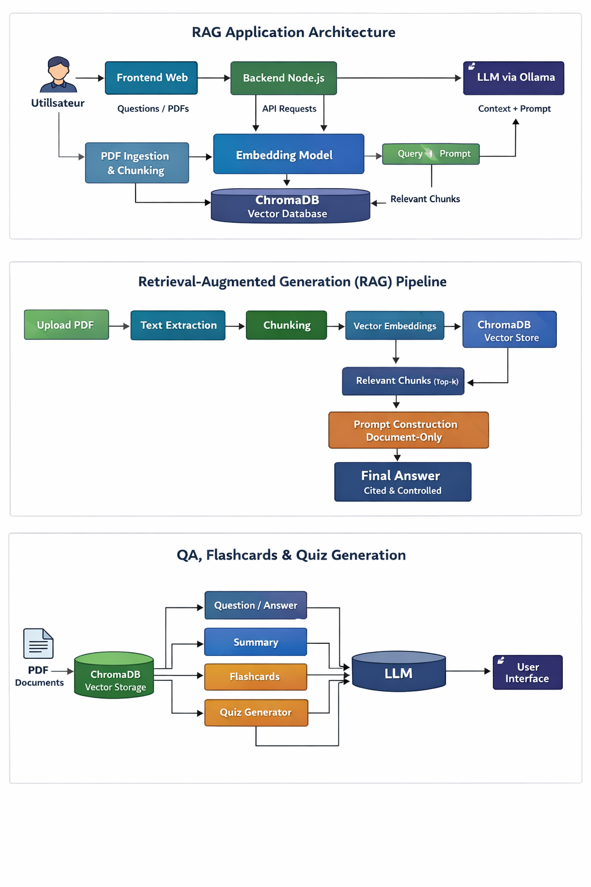

# MyNote (RAG PDF Study App)

MyNote is a Retrieval-Augmented Generation (RAG) application that lets users upload PDF documents and interact with their content through:
- Question answering (streamed via SSE)
- Flashcards
- Quiz generation

The backend uses LangChain for ingestion and retrieval, Ollama for LLM + embeddings, and ChromaDB as the vector store.

## Features
- Upload PDFs (up to 3 files, 15 MB each)
- Semantic search over document chunks
- Strict document-only answers (reduces hallucinations)
- Flashcards and quiz generation from retrieved context
- Source filtering by document name

## Architecture Overview
- Frontend: static UI served from `public/`
- Backend: Express server (`index.js`, `src/server.js`)
- Orchestration: `src/controllers/OrchestrationController.js`
- Services:
  - Ingestion: `src/services/Ingestion.js`
  - Q&A: `src/services/ResponseQst.js`
  - Flashcards: `src/services/FlachCrad.js`
  - Quiz: `src/services/Quiz.js`
- Vector store: ChromaDB (`chromadb`)
- LLM + embeddings: Ollama (`@langchain/ollama`)

### RAG Flow
1) PDF upload -> text extraction
2) Chunking (500 chars, overlap 80)
3) Embeddings via Ollama
4) Store vectors in ChromaDB
5) Retrieval (top-k) + strict prompt
6) LLM generates answer, flashcards, or quiz

## Requirements
- Node.js 18+ recommended
- Ollama running locally
- ChromaDB running (Docker recommended)

## Installation
1) Install dependencies:
```bash
npm install
```

2) Start ChromaDB (Docker):
```bash
docker compose up -d chroma
```

3) Start Ollama and pull models:
```bash
ollama serve
ollama pull phi3
ollama pull nomic-embed-text
```

4) Configure environment variables in `.env`:
```bash
OLLAMA_BASE_URL=http://localhost:11434
OLLAMA_MODEL=phi3
OLLAMA_EMBED_MODEL=nomic-embed-text

CHROMA_COLLECTION=pdf_notes
CHROMA_URL=http://localhost:8000
```

## Run the App
```bash
npm start
```
Then open `http://localhost:3000`.

## API Endpoints
Base URL: `http://localhost:3000`

### POST /api/upload
Upload PDFs (multipart/form-data) under the `pdfs` field.

### POST /api/ask
Ask a question using SSE streaming.
```json
{
  "question": "What is the project lifecycle?",
  "source": "myfile.pdf",
  "lang": "en"
}
```

### POST /api/flashcards
Generate flashcards from selected sources.
```json
{
  "topic": "key concepts",
  "source": "myfile.pdf"
}
```

### POST /api/quiz
Generate a quiz from selected sources.
```json
{
  "topic": "main ideas",
  "source": "myfile.pdf"
}
```

### POST /api/delete-source
Remove a document from the vector store.
```json
{
  "source": "myfile.pdf"
}
```

## Data Storage
- Uploaded PDFs: `src/data/uploads/`
- ChromaDB data (Docker volume): `data/chroma/`

## Notes
- `/api/ask` streams tokens using `text/event-stream` (SSE).
- The system enforces document-only answers. If context is insufficient, it returns a fixed fallback message.
- Flashcards and quiz outputs are parsed and normalized by `src/utils/JsonHelper.js`.
- `delete-source` removes vectors from ChromaDB but does not delete uploaded files.
